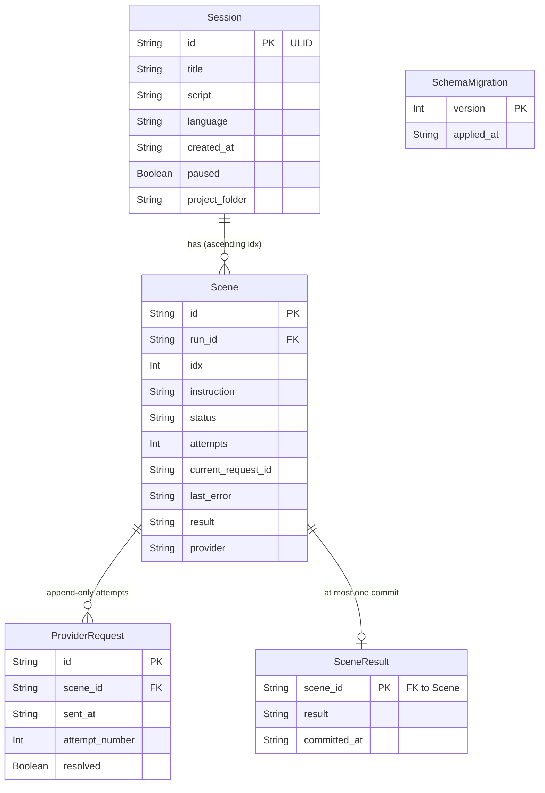

# Data Model Documentation

This document describes Vid4You's data model: sessions, chunks (scenes), stage attempts, and the result-commit records that make a repeated success confirmation harmless. It replaces the previous version, which described an unrelated inherited application's entities and had no bearing on this product.

The store is embedded SQLite via Node's built-in `node:sqlite` — see `docs/adr/0002-persistence.md` for why, and `openspec/changes/define-backend-stack/skeleton/src/db.ts` for the reference implementation this document describes.

**Scope note, stated once here rather than on every field:** the current implementation (`define-backend-stack`'s walking skeleton, extended by `define-persistence`) is deliberately narrow — it models **one** generic provider-backed stage ("image") standing in for the PRD's five stages, and it does not simulate voice generation, timestamp alignment, or script decomposition. Fields the PRD implies for those stages are noted below as **not modelled**, with the reason, rather than invented ahead of the stories that own them.

## Model Descriptions

### 1. Session (`runs` table)

Represents one video project. PRD §3, §4.1, §8.1, §9, §12.2.

**Fields:**
- `id`: system-generated identifier (Primary Key) — §3. **ULID**, not a random UUID (`start-video-project`, JOS-134, Decision 3): opaque (not derived from the title) *and* creation-ordered (sorts lexicographically by creation time), which a UUIDv4 is not.
- `title`: the project's title — §3. **Write-once**, like `script`; enforced by a store trigger (see *Store-enforced locks* below).
- `script`: the script exactly as submitted, **write-once from registration onward** — §4.2/D10 (`start-video-project`, JOS-134, Decisions 1 and 2). Emptiness is judged on a trimmed view at the validation boundary; the stored value is never trimmed. No operation updates this column after creation, and since `lock-script-and-narration` (JOS-137) the **store itself refuses** any update of it, in every state (see *Store-enforced locks* below).
- `language`: script language, selected from the hardcoded supported list; a session cannot exist without one — §4.1. Also write-once, same as `script`, and enforced the same way.
- `created_at`: creation timestamp; also drives the project-folder name, to the minute — §12.2
- `state`: **derived**, not stored — one of the eight session states in §8.1, computed from the session's scenes each time it is read (`orchestrator.ts`'s `deriveSessionState`). A session with zero scenes (the state immediately after `start-video-project` registers it, before decomposition creates any) derives to `submitted`. This skeleton only ever produces `submitted`, `chunks-processing`, `final-video` or `failed`, since voice-over and decomposition phases aren't modelled.
- `paused`: a marker on top of the current state, never a state itself, per §8.1/§9 (Decision 8, `define-live-updates`)
- `failure`: the phase failure the session carries when it is `failed`, as JSON: `{ phase, cause, retryable, occurredAt }` with `phase` either `voice-over` (`generate-voice-over`, JOS-136, which added the column in migration 4) or `decomposition` (JOS-144: a refused system-generated decomposition, whose cause never blames the User's script). A session with no chunks and a failure derives to `failed` in that phase. A successful chunk registration clears it.
- `project_folder`: the real per-project folder name under a configured root, named `<title> <YYYY-MM-DD HH-mm>` with a counter suffix on collision — §12.2 (Decision 4, `define-persistence`)

**Not modelled** (no consumer yet — see the scope note): voice-over/alignment provider bindings, MP3 and timestamp references, total narration duration (§11.2) — these belong to stages this skeleton doesn't simulate.

**Relationships:** one session has many scenes.

### 2. Scene / chunk (`scenes` table)

Represents one narrated segment of the video. PRD §3, §6, §7.2, §7.3, §8.2, §10.3.

**Fields:**
- `id`: identifier, unique within the session and invariable once assigned (Primary Key) — §6
- `run_id`: the owning session (Foreign Key)
- `idx`: the PRD's chunk `ID`, the consecutive integers 1..N in the fragments' order — §6. **Unique within its session** (`scenes_run_id_idx_unique` on `(run_id, idx)`, `assign-scene-identifiers`, JOS-144, Decision 2), not across sessions. Locked once the chunk exists (see *Store-enforced locks*). The UUID `id` stays the internal key routes and foreign keys use.
- `instruction`: the skeleton image stage's input; correctable only while the scene is `failed` — §3, §10.3. Registration sets it to `image_instruction` (JOS-144, Decision 3). A correction currently updates only this field, so the two can diverge until JOS-145 moves the image stage to `image_instruction` and JOS-157 owns correcting it.
- `prompt`: the PRD's `PROMPT`, the exact fragment of the script this chunk narrates — §3. Set at registration, **locked** afterwards. The fragments joined in order reproduce the script apart from whitespace (§4.2), which registration checks.
- `image_instruction`: the PRD's `IMAGE`, generated by the reasoning provider at registration — §3, §5 step 5. Correctable after a failed image stage (§10.3).
- `video_instruction`: the PRD's `VIDEO`, generated with `IMAGE` — §3. Correctable after a failed clip stage (§10.3).
- `status`: one of the six chunk states in §8.2. This skeleton only ever produces `submitted`, `image-generating`, `chunk-complete` or `failed` (never `image-complete`/`video-generating` individually, since there is no second real stage)
- `attempts`: attempt count within the current 1+3 retry cycle — §10.1
- `current_request_id`: the in-flight provider request's external id, or null
- `last_error`: the most recent failure reason, when applicable
- `result`: the **relative path** to the real artefact file written under the session's project folder — §12.2 (Decision 4)
- `provider`: the (stubbed) provider name that produced the result — §11.2
- `provider_mode` / `provider_latency_ms`: skeleton-only fields configuring the stubbed provider's behaviour for that scene; not part of the real product model

**Not modelled:** narration interval start/end, requested clip duration, speed factor and its warning flag (§7.2, §7.3, AC23) — these come from the real media pipeline (`define-media-assembly`, US-15), which this skeleton does not simulate.

**Relationships:** many scenes belong to one session; one scene has many stage attempts (provider requests) and at most one committed result.

**Keying at the read boundary** (`consult-session`, JOS-135, Decision 2): a scene is looked up by the pair `(session id, scene id)`, never by scene id alone — `id` is only unique *within* its owning session, so a repository method that took just the scene id could return a different session's scene of the same id. `getSceneForRun(runId, sceneId)` enforces this at the data-access layer, not by a caller-side check after the fact. The same story's file-reference resolution refuses any path that resolves outside the requesting session's own `project_folder` (Decision 2, reusing `define-persistence` Decision 4's folder-scoping), so a scene result cannot be read through a different session's address either.

### 3. Provider request / stage attempt (`provider_requests` table)

An append-only record of one attempt to call the (stubbed) provider for a scene. PRD §10.1, §10.3, §11, §11.2.

**Fields:**
- `id`: the external request identifier — without this, restart resumption (§12.1) is impossible
- `scene_id`: the scene this attempt belongs to (Foreign Key)
- `sent_at`: when the request was recorded — written **before** the request is sent (Decision 2), so a crash between send and response still leaves a trace
- `latency_ms`, `mode`: skeleton-only fields the stub provider uses to compute its outcome deterministically
- `attempt_number`: sequence within the current 1+3 budget — §10.1
- `resolved`: whether this specific request's delivery has been processed (guards against redelivering the same webhook event — a different, narrower concern than the scene-level idempotency below)

**Never updated in place** once written except to flip `resolved`: each retry inserts a **new** row rather than mutating the previous attempt (Decision 1) — proven in `openspec/changes/define-persistence/reports/2026-09-25-step-8-curl-endpoint-testing.md` §8.6.

### 4. Scene result commit (`scene_results` table)

The actual idempotency guarantee. PRD §12.1 ("more than one success confirmation for the same generation must not duplicate a result").

**Fields:**
- `scene_id`: **Primary Key** — this is the whole mechanism. A second attempt to insert a row for a scene that already has one is rejected by the store itself, not by application code that read a flag first (Decision 3, `define-persistence`, the change's central finding — see `docs/adr/0002-persistence.md`).
- `result`: the committed relative artefact path
- `committed_at`: when the commit happened

### 5. Schema migrations (`schema_migrations` table)

Tracks which versioned migrations have been applied, so an existing session's data survives a schema upgrade (§11.2, Decision 6). Fields: `version` (Primary Key), `applied_at`. Migration 5 adds the three session-content triggers and migration 6 the two voice-over triggers (`lock-script-and-narration`, JOS-137); migration 7 adds `prompt`, `image_instruction` and `video_instruction` to `scenes`, the unique chunk-number index and the four chunk triggers (`assign-scene-identifiers`, JOS-144); they are separate because a database that had already applied 5 must still receive the voice-over triggers, and an applied migration is never edited.

## Store-enforced locks

What must never change is refused by the store itself (`lock-script-and-narration`, JOS-137; PRD §4.2, D10), so the rule holds for every caller, present or future, and not only for the repository functions in `backend/src/db.ts`. Each trigger aborts the statement with a message that names what was touched.

| Trigger | Table | Fires on | Refusal message |
|---|---|---|---|
| `runs_title_locked` | `runs` | `UPDATE OF title` | `locked: runs.title cannot be modified after registration` |
| `runs_script_locked` | `runs` | `UPDATE OF script` | `locked: runs.script cannot be modified after registration` |
| `runs_language_locked` | `runs` | `UPDATE OF language` | `locked: runs.language cannot be modified after registration` |
| `voice_overs_no_update` | `voice_overs` | any `UPDATE` | `locked: voice_overs cannot be modified once the narration is complete` |
| `voice_overs_no_delete` | `voice_overs` | any `DELETE` | `locked: voice_overs cannot be deleted once the narration is complete` |
| `scenes_idx_locked` | `scenes` | `UPDATE OF idx` | `locked: scenes.idx cannot be modified once the chunk is established` |
| `scenes_prompt_locked` | `scenes` | `UPDATE OF prompt` | `locked: scenes.prompt cannot be modified once the chunk is established` |
| `scenes_run_id_locked` | `scenes` | `UPDATE OF run_id` | `locked: scenes.run_id cannot be modified once the chunk is established` |
| `scenes_no_delete` | `scenes` | any `DELETE` | `locked: scenes cannot be deleted once the chunk is established` |

- `UPDATE OF <column>` fires whenever the column appears in a `SET` list, **even for an identical value**: nothing legitimate writes these columns after the `INSERT`, so any write is a bug worth failing loudly. Updating the other `runs` columns (`paused`, `project_folder`, `voice_provider_id`, `failure`) is unaffected.
- The four `scenes` triggers come from `assign-scene-identifiers` (JOS-144, migration 7): an established chunk is never split, merged, deleted or reordered (PRD §6). `image_instruction`, `video_instruction`, `instruction` and `status` stay writable, since §10.3 lets the visual instructions be corrected and the stages move the status. A duplicate chunk number is refused by the unique index `scenes_run_id_idx_unique`.
- There is no trigger on `INSERT`: a second voice-over for a session is already refused by `voice_overs`' primary key (`run_id`).
- The `voice_overs` table is created by migration 4 of `generate-voice-over` (JOS-136) and is documented with that change; this section only records how it is protected.
- **The one exception** is `resetAll()` in `backend/src/db.ts`, which exists only for tests and empties the store. Inside a single transaction it drops `voice_overs_no_delete` and `scenes_no_delete`, deletes every row and recreates both triggers from the same definition constants the migrations use; if any step fails the whole reset rolls back and the triggers are left in place.
- The MP3 file has the matching guarantee: it is written with `writeArtefactOnce`, which fails if the target exists and never replaces it (see `docs/backend-standards.md`, Persistence).

## Entity Relationship Diagram

## Key Design Principles

1. **Append-only attempts, mutable read model.** `provider_requests` never rewrites history; `scenes.status`/`result` is a derived, idempotently-updatable read model on top of it (Decision 1).
2. **The store enforces the guarantees that matter, not application code.** Idempotency (§4 above) and referential integrity (foreign keys, `PRAGMA foreign_keys = ON`) are structural, not conventions a caller has to remember to check first (Decision 3).
3. **File references are relative, always.** Every artefact path is relative to the owning session's recorded `project_folder`, so renaming that folder in place requires updating exactly one column, not every artefact row (Decision 4).
4. **No entity models a phase this skeleton doesn't simulate.** Where the PRD implies a field (narration interval, speed factor, voice/alignment provider bindings) with no current writer or reader, it is documented as **not modelled** here rather than added speculatively — a story that needs it adds it as its own delta.
5. **Schema versioning from the start.** `schema_migrations` exists even though there is currently one real migration, so a long-lived session (sessions never expire, §12.2) can outlive several schema versions without its existing rows being touched (Decision 6).
6. **What must never change is locked by the store, not by convention.** The script, title and language, and a completed voice-over record, are protected by triggers (see *Store-enforced locks*), so a new caller that forgets the rule fails loudly instead of corrupting a session.

## Notes

- All identifiers are opaque strings, not auto-incrementing integers, consistent with §3's "system-generated identifier." **Session** identifiers are ULIDs (`start-video-project`, JOS-134, Decision 3 — opaque *and* creation-ordered, which §12.2's "two sessions in the same minute" case relies on being observable). Scene, provider-request and scene-result identifiers remain UUIDs — §12.3's "reached by identifier" guarantee is specifically about sessions, not these internal records.
- No entity in this model is a security boundary — per §12.3, session separation is a functional-integrity property (a project must not show or overwrite another project's data), not an access-control mechanism. There are no accounts, roles or permissions in this data model.
- What's still open: the real persistence engine choice is **not** open — that's `docs/adr/0002-persistence.md`, this document's basis. What remains genuinely open is the full multi-stage model (voice, alignment, video as their own simulated stages) and the real hardcoded parameter values (US-33), both out of scope for the changes that produced this document.
