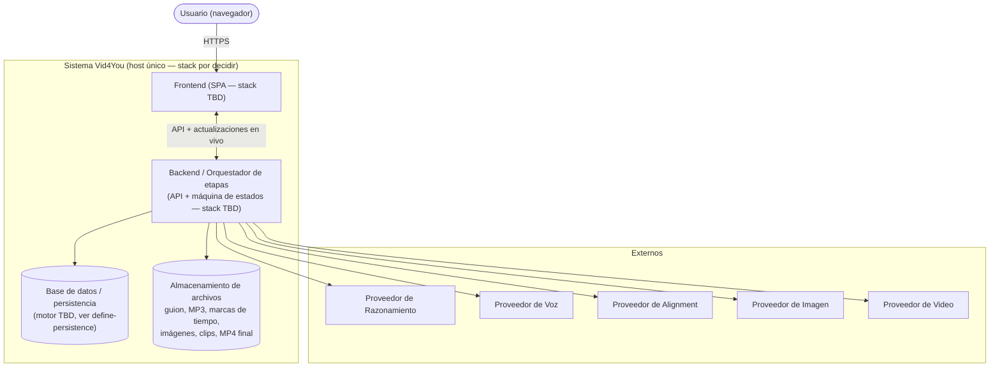
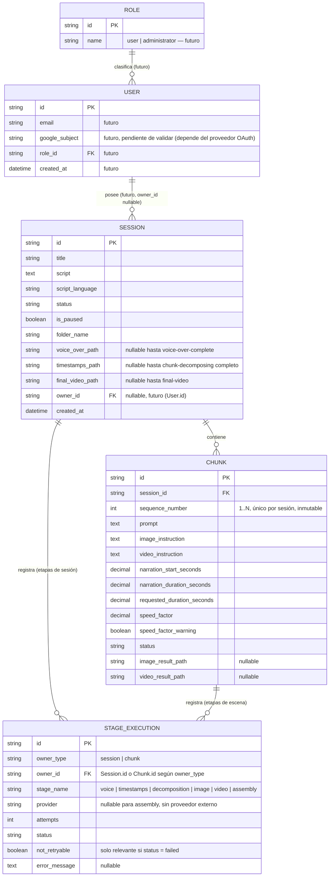
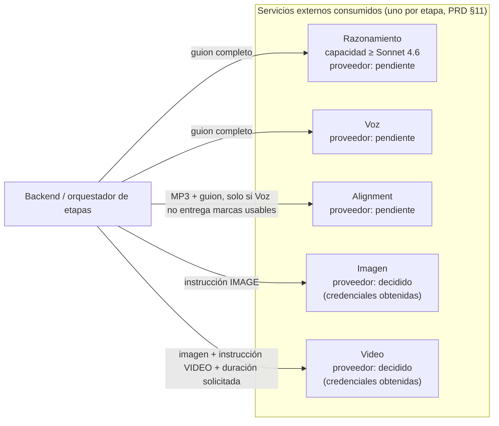

## Índice

0. [Ficha del proyecto](#0-ficha-del-proyecto)
1. [Descripción general del producto](#1-descripción-general-del-producto)
2. [Arquitectura del sistema](#2-arquitectura-del-sistema)
3. [Modelo de datos](#3-modelo-de-datos)
4. [Especificación de la API](#4-especificación-de-la-api)
5. [Historias de usuario](#5-historias-de-usuario)
6. [Tickets de trabajo](#6-tickets-de-trabajo)
7. [Pull requests](#7-pull-requests)

---

## 0. Ficha del proyecto

### **0.1. Tu nombre completo:**

Jose Antonio Munoz Elguezabal

### **0.2. Nombre del proyecto:**

Vid4You

### **0.3. Descripción breve del proyecto:**

El sistema es una plataforma de generación de contenido End to End, la imagen y el video de cada chunk pueden ser entregables independientes, mientras procesa cada imagen y cada video se pueden descargar por partes, finalmente el video editado final contiene todos los chunks de video editados, unidos y narrados por el voice-over generado.

### **0.4. URL del proyecto:**

TBD

### 0.5. URL o archivo comprimido del repositorio

https://github.com/TonyMElguezabal/AI4Devs-finalproject


---

## 1. Descripción general del producto

Vid4You es una aplicación web que convierte un script de vídeo finalmente en un video completo pasando por una lista de escenas narradas (“chunks”) en un conjunto de imágenes y videos cortos generados por IA: una imagen y un video por cada chunk.

### **1.1. Objetivo:**

Vid4You es una aplicación web que convierte un guion de texto en un video narrado listo para publicar, en formato horizontal MP4 (16:9). El usuario solo aporta un título y un guion: el sistema genera automáticamente la narración en audio, las imágenes y los clips de cada escena, y monta el video final sincronizado con la voz. Así resuelve el problema de producir contenido narrado (por ejemplo, para YouTube) sin necesidad de grabar voz, editar video ni tener conocimientos de edición audiovisual.

### **1.2. Características y funcionalidades principales:**

- Creación de sesiones (proyectos de video) a partir de un título y un guion.
- Generación automática de un voice-over (narración en audio) completo por guion, en el idioma seleccionado por el usuario.
- Obtención de las marcas de tiempo que sitúan cada fragmento del guion dentro del audio narrado.
- División automática del guion en escenas (chunks) respetando fronteras de oración, y generación de las instrucciones visuales de imagen y video de cada escena.
- Generación de una imagen y un clip de video por escena, sincronizados con su fragmento narrado.
- Montaje del video final: sincronización de los clips con el audio completo y ensamblado en un único MP4 horizontal.
- Visualización en tiempo real del progreso por fase y por escena, incluyendo resultados disponibles y errores.
- Pausa de la generación antes del lanzamiento de una fase, y continuación explícita por parte del usuario.
- Descarga parcial de resultados (imágenes y clips de escenas individuales) durante el procesamiento, y descarga del video final al completarse.
- Reintentos automáticos (hasta 3 por etapa) y reintento manual ante fallos.
- Corrección del prompt visual (imagen o video) de una escena que haya fallado, sin alterar el guion ni el orden narrativo.
- Persistencia de sesiones, estados y resultados, incluso tras reinicios del sistema.

### **1.3. Diseño y experiencia de usuario:**

_Pendiente. Aún no existen mockups, wireframes ni capturas de la interfaz, ya que el frontend todavía no se ha implementado. Esta sección se completará con imágenes y/o un videotutorial de la experiencia de usuario una vez el frontend esté definido y construido. (TBD mockups after frontend)_

### **1.4. Instrucciones de instalación:**

_Borrador — pendiente de actualizar cuando se cierre la decisión de stack (backend y frontend) y de persistencia del proyecto._

```bash
# 1. Clonar el repositorio
git clone <URL_DEL_REPOSITORIO>
cd AI4Devs-finalproject

# 2. Instalar dependencias
# TBD — comando exacto pendiente de la decisión de stack (backend y frontend)

# 3. Configurar variables de entorno
# Crear un archivo .env local (no versionado) con, como mínimo, las credenciales de los
# proveedores de IA usados por cada etapa (razonamiento, voz, alineación, imagen y video).
# TBD — nombres exactos de las variables, pendientes de la decisión de stack

# 4. Base de datos (si aplica)
# TBD — pendiente de la decisión de persistencia

# 5. Arrancar el proyecto
# TBD — comando de arranque pendiente de la decisión de stack
```

---

## 2. Arquitectura del Sistema

### **2.1. Diagrama de arquitectura:**

> El stack concreto (backend, frontend, base de datos) todavía no está decidido — está pendiente de los spikes `define-backend-stack`, `define-frontend-stack` y `define-persistence` en `openspec/changes/`. Por eso el diagrama y la justificación describen el **patrón** de arquitectura y los componentes por su responsabilidad, no la tecnología concreta.



**Patrón.** Arquitectura cliente-servidor en capas, con el backend actuando como orquestador de un pipeline de etapas con estado (una máquina de estados por sesión y por escena). Se elige por los propios requisitos funcionales del PRD: cada etapa tiene su propio presupuesto de reintentos y su límite de concurrencia compartido entre sesiones (`docs/PRD.md` §10.1, §11), una pausa afecta a la sesión completa deteniendo el lanzamiento de nuevas etapas (§9), y el progreso se refleja en vivo sin recargar la página (§8.3). Centralizar esa lógica en un backend orquestador es lo que permite cumplir esas reglas de forma consistente.

**Beneficios.** Separación clara de responsabilidades (interfaz / orquestación y reglas de negocio / persistencia y archivos / proveedores externos); encaja de forma natural con la máquina de estados de sesión y chunk ya definida en el PRD (§8); es una arquitectura simple de operar para una instalación de un único host, como es este MVP.

**Sacrificios.** Un solo backend concentra tanto la API como la orquestación de etapas (no hay separación en workers o colas de trabajo independientes); no está pensada para multiusuario ni para alta concurrencia entre sesiones de distintos usuarios.

**Evolución si creciera el uso** (mención orientativa, sin comprometerse a implementarla ahora): si el volumen de sesiones o escenas concurrentes creciera, el orquestador de etapas podría separarse del servidor de API en workers o colas de trabajo independientes, escalables por separado.

### **2.2. Descripción de componentes principales:**

| Componente | Responsabilidad |
|---|---|
| Frontend (SPA, stack por decidir) | Interfaz de usuario: alta de sesión, progreso por fase y por escena en vivo, descargas parciales y del video final, formularios de corrección de prompt ante fallo (`docs/PRD.md` §8.3, §10.3). |
| Backend / orquestador de etapas (stack por decidir) | Expone la API, aplica la máquina de estados de sesión y chunk, la política de reintentos y el límite de concurrencia por etapa, gestiona la pausa/continuación, y llama a los proveedores de IA (§8–§11). |
| Base de datos / persistencia (motor por decidir, ver `define-persistence`) | Persistencia de sesiones, chunks, estados y referencias a resultados, resiliente a reinicios (§12.1). |
| Almacenamiento de archivos | Guion, voice-over completo (MP3), marcas de tiempo, imágenes y clips por escena, y MP4 final, organizados por carpeta de proyecto (§12.2). |
| Integraciones con proveedores de IA (externos) | Un proveedor por etapa — razonamiento, voz, alignment, imagen y video — hardcodeado en el MVP, con credenciales vía entorno o fichero local de secretos (§11). |

### **2.3. Descripción de alto nivel del proyecto y estructura de ficheros**

Estructura **actual** del repositorio:

```
AI4Devs-finalproject/
├── docs/            # PRD, estándares (backend/frontend/documentación), spec de API y modelo de datos
├── ai-specs/        # Fuente canónica de skills y agentes reutilizables entre herramientas de IA
├── openspec/        # Propuestas, specs y cambios gestionados con OpenSpec (spec-driven development)
├── packages/
│   └── specboot/    # Tooling de arranque de OpenSpec para este y otros proyectos
├── AGENTS.md, CLAUDE.md, GEMINI.md, codex.md   # Symlinks → docs/base-standards.md
└── readme.md
```

Estructura **planeada**, aún no creada: carpetas `backend/` y `frontend/` en la raíz, cuyo contenido y convenciones concretas se fijarán al cerrar los spikes `define-backend-stack` y `define-frontend-stack`. En ese momento se reescribirán `docs/backend-standards.md` y `docs/frontend-standards.md` (hoy documentan el stack de un proyecto anterior, no aplicable a Vid4You) para que describan la estructura interna real de cada carpeta.

### **2.4. Infraestructura y despliegue**

> Borrador — varias piezas dependen de decisiones aún no tomadas (`define-backend-stack`, `define-frontend-stack`, `define-persistence`). No se ha decidido ningún pipeline de CI/CD; el despliegue actual, si lo hay, es manual.

- **Host**: una única instancia de servidor (por ejemplo, una EC2 o similar; el proveedor concreto está pendiente), accesible mediante una URL pública. En esta entrega no hay login: cualquiera con la URL puede acceder a la aplicación (ver §2.5, aclarado explícitamente por el propietario del producto).
- **Variables de entorno**: gestionadas vía un fichero `.env` no versionado en el host, con al menos las credenciales de los proveedores de IA de cada etapa (`docs/PRD.md` §11). Los nombres exactos de las variables quedan pendientes de la decisión de stack.
- **Base de datos y despliegue de la app**: pendientes de `define-persistence`, `define-backend-stack` y `define-frontend-stack`.

### **2.5. Seguridad**

- **Modelo de acceso del MVP actual**: sin cuentas ni autenticación; cualquiera que tenga la URL puede acceder a la aplicación (aclaración explícita del propietario del producto). El aislamiento entre sesiones es un requisito de integridad funcional, no un control de seguridad de acceso (`docs/PRD.md` §12.3): evita que una sesión sobrescriba o muestre datos de otra, pero no protege frente a terceros.
- **Gestión de secretos**: credenciales de los proveedores de IA gestionadas vía `.env` con permisos de fichero restringidos en el host; nunca hardcodeadas en el código (§11).
- **Transporte**: HTTPS en el host de despliegue, con certificados gestionados vía Certbot.
- **Evolución futura** (explícitamente fuera de esta entrega, aclarado por el propietario del producto): autenticación con Google OAuth y autorización por roles, gestionada por un rol Administrador — alineado con el rol Administrador que el PRD ya prevé como post-MVP (§2.1, §11.2: configuración, diagnóstico, cambio de proveedor y reportes en `/admin`).
- No se añaden controles de seguridad multiusuario (RBAC granular, límites de tasa por usuario, etc.) mientras el modelo de acceso siga siendo de instalación única sin cuentas.

### **2.6. Tests**

> En esta entrega todavía no hay código de aplicación, por lo que esto describe la **estrategia planificada**, no resultados de ejecución.

La estrategia sigue el principio de TDD ya fijado en los estándares del proyecto (`docs/base-standards.md` §1) y los pasos obligatorios que cada tarea OpenSpec debe cumplir, detallados en `docs/openspec-tasks-mandatory-steps.md` (no se duplican aquí):

- **Tests unitarios**, junto con verificación del estado de la base de datos, antes de dar una tarea por completada.
- **Pruebas manuales de los endpoints con curl**, ejecutadas por el propio agente antes de cerrar la tarea.
- **Tests E2E con Playwright MCP**, ejecutados por el propio agente sobre el flujo completo de usuario, cuando la tarea afecta a la interfaz.

La ejecución real de estos tests comenzará cuando exista código de aplicación, tras cerrarse las decisiones de `define-backend-stack` y `define-frontend-stack`.

---

## 3. Modelo de Datos

> El motor de persistencia concreto todavía no está decidido (pendiente de `define-persistence`, ver sección 2). Por eso los tipos de dato son aproximados y los identificadores se muestran como `string` genérico; se afinarán al cerrar esa decisión. Las entidades `User` y `Role`, y el campo `Session.owner_id`, son diseño **a futuro**: el MVP no implementa autenticación ni cuentas (`docs/PRD.md` §2.1, §2.3, §12.3; ver también sección 2.5 del README), pero el modelo se prepara para soportarlo sin necesitar una migración disruptiva más adelante.

### **3.1. Diagrama del modelo de datos:**



**Nota de implementación sobre `STAGE_EXECUTION`.** El par `owner_type`/`owner_id` es una asociación polimórfica a nivel lógico (una etapa puede pertenecer a una `Session` o a un `Chunk`, nunca a ambas). Un motor relacional clásico no expresa esto como una única FK tipada; la implementación física habitual sería dos columnas nullable mutuamente excluyentes (`session_id`, `chunk_id`) o una tabla de enlace por tipo de dueño. Se deja como decisión de `define-persistence`.

### **3.2. Descripción de entidades principales:**

| Entidad | Propósito | Campos clave | Origen (PRD) |
|---|---|---|---|
| **Session** | Representa un proyecto de video: título, guion, idioma, progreso y resultados. | `id` PK; `title`, `script`, `script_language` (no vacíos, guion inmutable tras iniciar el proyecto); `status` (uno de los 8 estados de sesión); `is_paused` (marca independiente del estado); `folder_name` (carpeta de proyecto); `voice_over_path`, `timestamps_path`, `final_video_path`; `owner_id` FK nullable (futuro). | §3, §4.1, §4.2, §8.1, §9, §12.1, §12.2 |
| **Chunk** | Una escena del video: fragmento narrado, instrucciones visuales, intervalo de narración y resultados. | `id` PK; `session_id` FK; `sequence_number` (identificador 1..N único por sesión, inmutable); `prompt`, `image_instruction`, `video_instruction`; `narration_start_seconds`/`narration_duration_seconds`; `requested_duration_seconds`/`speed_factor`/`speed_factor_warning`; `status` (uno de los 6 estados de chunk); `image_result_path`/`video_result_path`. | §3, §6, §6.1, §7.2, §7.3, §8.2 |
| **StageExecution** | Registro diagnóstico de una etapa (proveedor usado e intentos realizados), sin exponer credenciales. Cubre las 6 etapas recuperables del PRD: voz, marcas de tiempo, descomposición, imagen, video y montaje. | `id` PK; `owner_type`/`owner_id` (Session para voz/timestamps/descomposición/montaje, Chunk para imagen/video); `stage_name`; `provider`; `attempts` (hasta 4: intento inicial + 3 reintentos); `status`; `not_retryable`; `error_message`. | §3 ("cada etapa conserva la identificación del proveedor..."), §10.1, §10.3, §11, §11.1 |
| **User** *(futuro)* | Cuenta de usuario para la versión con autenticación. No existe en el MVP. | `id` PK; `email`; `google_subject` (pendiente de validar, depende del proveedor OAuth elegido); `role_id` FK. | Aclaración del propietario del producto (auth a futuro); PRD §2.1/§11.2 (rol Administrador post-MVP) |
| **Role** *(futuro)* | Rol de autorización: `user` (por defecto) o `administrator`. No existe en el MVP. | `id` PK; `name`. | PRD §2.1, §11.2 (capacidades del rol Administrador: configuración, diagnóstico, cambio de proveedor, reportes en `/admin`) |

**No incluidas como entidades propias:**
- **Proveedores de IA**: en el MVP están hardcodeados (`docs/PRD.md` §11, sin ficheros de configuración ni interfaz de administración), por lo que `StageExecution.provider` es un valor identificador simple, no una fila de una tabla `Provider` configurable. Esa tabla podría introducirse si el rol Administrador post-MVP llega a reasignar proveedores (§11.2).
- **Marcas de tiempo detalladas (timestamps crudos)**: el PRD las trata como un fichero conservado localmente (§12.1, `Session.timestamps_path`), no como filas individuales por marca; el intervalo ya asignado a cada escena vive en `Chunk.narration_start_seconds`/`narration_duration_seconds`.

---

## 4. Especificación de la API

Vid4You no expone ninguna API propia para ser consumida por terceros. Es un sistema **consumidor**: llama a los servicios de varios proveedores de IA externos, uno por etapa (`docs/PRD.md` §11). Por eso, en lugar de una especificación OpenAPI de endpoints propios, esta sección documenta el mapeo de las integraciones salientes actualmente contempladas.

> Los proveedores concretos detrás de cada capacidad no están nombrados aquí: razonamiento, voz y alignment siguen abiertos, y aunque imagen y video ya están decididos con credenciales obtenidas (`openspec/changes/define-provider-configuration/`), esa propuesta todavía no cierra con un ADR publicado en el repo. El mapeo se documenta por capacidad, no por vendor, hasta que esa decisión quede registrada formalmente.



| Servicio (etapa) | Capacidad requerida | Entrada | Salida | Estado del proveedor | Referencia PRD |
|---|---|---|---|---|---|
| Razonamiento | Dividir el guion con fidelidad (§6.1) y generar las instrucciones `IMAGE`/`VIDEO` de cada chunk. Referencia de capacidad: equivalente a Sonnet 4.6 o superior. | Guion completo (texto) | Chunks con `PROMPT`/`IMAGE`/`VIDEO` | Pendiente de decidir (`define-provider-configuration`) | §6.1, §11 |
| Voz | Producir la narración completa en MP3, con voz/calidad/velocidad preconfiguradas, y entregar marcas de tiempo nativas cuando el proveedor las soporte. | Guion completo (texto) | Archivo MP3 + marcas de tiempo nativas (si existen) | Pendiente de decidir | §11, §11.1 |
| Alignment | Derivar las marcas de tiempo alineando el MP3 contra el guion, mecanismo de respaldo cuando las nativas no existen o no son usables. | MP3 generado + guion | Marcas de tiempo por fragmento | Pendiente de decidir | §11.1 |
| Imagen | Generar una imagen 16:9 con resolución mínima 1920×1080 a partir de texto. | Instrucción `IMAGE` (texto) | Imagen (archivo) | Decidido — credenciales ya obtenidas | §7.1, §11 |
| Video | Animar una imagen de referencia según una instrucción, respetando las duraciones admitidas por el proveedor. | Imagen generada + instrucción `VIDEO` + duración solicitada | Clip de video (archivo) | Decidido — credenciales ya obtenidas | §7.2, §11 |

**Notas de integración:**
- Hay un único proveedor activo por etapa, hardcodeado en la aplicación; no hay ficheros de configuración ni interfaz de administración para cambiarlo en el MVP (§2.3, §11), ni cambio de proveedor en tiempo de ejecución (§11.2).
- Las credenciales se leen desde el entorno local o un fichero de secretos local; nunca se hardcodean ni se versionan (§11).
- El resultado de cada llamada (proveedor usado, intentos realizados, si el fallo fue no reintentable) se registra en la entidad `StageExecution` descrita en la sección 3, sin exponer credenciales.

---

## 5. Historias de Usuario

La plantilla pide 3 historias principales; aquí se documentan las **8** que representan el flujo MVP completo de principio a fin (`docs/PRD.md` §5), en orden. Cada una tiene ya su change de OpenSpec con especificación completa en Given/When/Then (`openspec/changes/<slug>/specs/`); esta sección resume cada historia en el formato estándar y enlaza al detalle técnico en vez de duplicarlo. Los criterios de aceptación referencian las entidades reales de la sección 3 (`Session`, `Chunk`, `StageExecution`), no `docs/data-model.md` (contenido heredado de otro proyecto, aún sin actualizar).

**Historia de Usuario 1 — Iniciar un proyecto de video**
_Detalle técnico: [`openspec/changes/start-video-project`](../openspec/changes/start-video-project)_

Como usuario, quiero iniciar un proyecto con un título, un guion y un idioma, para que el sistema comience a generar mi video narrado.

Criterios de aceptación:
- **Given** un título y un guion no vacíos y un idioma de la lista soportada, **when** inicio el proyecto, **then** se registra una `Session` con un identificador único y estado `submitted`.
- **Given** un título o un guion vacío (o solo espacios), **when** intento iniciar el proyecto, **then** no se registra ninguna sesión y se informa la causa.
- **Given** un guion sin idioma seleccionado, **when** intento iniciar el proyecto, **then** no se registra la sesión y no se llama a ningún proveedor.
- **Given** una sesión ya registrada, **when** se consulta su título, guion o idioma, **then** son exactamente lo enviado y no pueden modificarse después.

**Historia de Usuario 2 — Generar la narración completa (voice-over)**
_Detalle técnico: [`openspec/changes/generate-voice-over`](../openspec/changes/generate-voice-over)_

Como usuario, quiero que el sistema narre automáticamente mi guion completo en un único audio, para no tener que grabar ni contratar una voz.

Criterios de aceptación:
- **Given** una `Session` en `submitted`, **when** se registra, **then** la generación de voz se lanza sin acción mía y la sesión pasa a `voice-over-generating` antes de llamar al proveedor.
- **Given** una narración exitosa, **when** el proveedor devuelve el audio, **then** se guarda exactamente un MP3 en la carpeta del proyecto, se registra su duración, y la sesión pasa a `voice-over-complete`.
- **Given** un rechazo no reintentable del proveedor (p. ej. filtro de contenido), **when** ocurre, **then** la sesión pasa a `failed` con causa mostrada, sin reintento automático y sin alterar el guion.
- **Given** una narración ya completada, **when** llega una segunda confirmación de éxito, **then** no se crea un segundo voice-over ni se relanza ninguna fase.

**Historia de Usuario 3 — Descomponer el guion en escenas**
_Detalle técnico: [`openspec/changes/decompose-script-into-chunks`](../openspec/changes/decompose-script-into-chunks)_

Como usuario, quiero que el sistema divida automáticamente mi guion narrado en escenas con sus instrucciones visuales, para no tener que segmentarlo ni describir cada imagen manualmente.

Criterios de aceptación:
- **Given** una sesión en `voice-over-complete`, **when** se lanza la descomposición, **then** la sesión pasa a `chunk-decomposing` y se obtienen las marcas de tiempo (nativas o por alineación, nunca ambas para el mismo intento).
- **Given** el guion segmentado, **when** se generan los `Chunk`, **then** cada uno tiene `sequence_number` consecutivo, y `PROMPT`/`IMAGE`/`VIDEO` completos.
- **Given** los `PROMPT` de todos los chunks unidos en orden, **when** se comparan con el guion bloqueado, **then** son idénticos salvo normalización de espacios.
- **Given** los intervalos de narración de todos los chunks, **when** se ordenan por `sequence_number`, **then** son contiguos, sin solapes, y cubren de 0 a la duración total del voice-over.
- **Given** una oración que no cabe en las cotas de duración y no tiene frontera de cláusula, **when** se segmenta, **then** se conserva entera con una advertencia de factor de velocidad, sin que esto sea un fallo.

**Historia de Usuario 4 — Generar la imagen de una escena**
_Detalle técnico: [`openspec/changes/generate-chunk-image`](../openspec/changes/generate-chunk-image)_

Como usuario, quiero que el sistema genere automáticamente la imagen de cada escena a partir de su instrucción visual, para no tener que crear ni subir imágenes manualmente.

Criterios de aceptación:
- **Given** un `Chunk` con instrucción `IMAGE` no vacía, **when** se lanza la generación, **then** el chunk pasa a `image-generating` y, al terminar con éxito, a `image-complete` con `image_result_path` guardado localmente.
- **Given** un resultado entregado como enlace temporal, **when** se recibe, **then** se descarga y persiste localmente antes de marcar la etapa como exitosa.
- **Given** un chunk cuya etapa de imagen está `failed`, **when** el usuario reintenta con la misma instrucción o corrige únicamente `IMAGE`, **then** se lanza un nuevo intento sin tocar `ID`, `PROMPT` ni el orden.
- **Given** una escena que falla en esta etapa, **when** otras escenas de la sesión siguen procesando, **then** no se ven afectadas por ese fallo.

**Historia de Usuario 5 — Generar el clip de video de una escena**
_Detalle técnico: [`openspec/changes/generate-chunk-video`](../openspec/changes/generate-chunk-video)_

Como usuario, quiero que el sistema anime automáticamente la imagen de cada escena ajustando su duración a lo narrado, para obtener un clip sincronizado sin animarlo manualmente.

Criterios de aceptación:
- **Given** un chunk en `image-complete`, **when** se lanza la generación de video, **then** el chunk pasa a `video-generating` y se solicita al proveedor la duración admitida que requiere el **menor cambio de velocidad** respecto al intervalo narrado (no la más cercana en segundos); un empate exacto elige la duración más larga.
- **Given** un intervalo narrado menor que la duración mínima admitida, **when** se solicita el clip, **then** se pide esa duración mínima.
- **Given** un clip generado, **when** se completa, **then** se registran `requested_duration_seconds` y `speed_factor`, y si este supera el límite hardcodeado, se marca `speed_factor_warning` sin que sea un fallo.
- **Given** un chunk cuya etapa de video está `failed`, **when** el usuario reintenta o corrige `VIDEO`, **then** la imagen ya exitosa se reutiliza sin regenerarse, y `ID`/`PROMPT`/`IMAGE`/orden permanecen intactos.
- **Given** un clip exitoso, **when** otras escenas siguen procesando o han fallado, **then** ese clip puede descargarse individualmente.

**Historia de Usuario 6 — Montar el video final**
_Detalle técnico: [`openspec/changes/assemble-final-video`](../openspec/changes/assemble-final-video)_

Como usuario, quiero que el sistema una automáticamente todas mis escenas completas con la narración en un único MP4, para obtener un video listo para publicar sin editarlo manualmente.

Criterios de aceptación:
- **Given** todos los chunks de una sesión en `chunk-complete`, **when** se cumple esa condición, **then** el montaje se lanza automáticamente y la sesión pasa a `final-video-generating`.
- **Given** una sesión con al menos un chunk `failed` o pendiente, **when** se evalúa el lanzamiento del montaje, **then** no se lanza y la sesión nunca alcanza `final-video`.
- **Given** los clips ya generados, **when** se montan, **then** se ordenan por `sequence_number` ascendente (no por orden de finalización) y cada uno se coloca en su intervalo de narración ya persistido.
- **Given** el video final, **when** se produce, **then** su única pista de audio es el voice-over completo (se descarta el audio de cada clip), en H.264/AAC a la resolución y frame rate hardcodeados.
- **Given** un fallo de montaje, **when** se reintenta, **then** se reutilizan el voice-over y todas las escenas ya exitosas, sin regenerar ninguna.
- **Given** una sesión en `final-video`, **when** se consulta, **then** el MP4 final está disponible para descarga (el MP3, las marcas de tiempo y los textos generados nunca lo están).

**Historia de Usuario 7 — Consultar el progreso de una sesión**
_Detalle técnico: [`openspec/changes/consult-session`](../openspec/changes/consult-session)_

Como usuario, quiero consultar el progreso, los resultados y los errores de mi sesión por su identificador, para hacer seguimiento de mi video sin necesitar una cuenta.

Criterios de aceptación:
- **Given** el identificador de una sesión existente, **when** se consulta, **then** se muestran su título, guion, idioma, estado, marca de pausa, y sus escenas en orden ascendente de `sequence_number`, sin importar el orden en que terminaron.
- **Given** dos sesiones con el mismo título o chunks con el mismo `sequence_number`, **when** se consulta una de ellas, **then** solo se muestran sus propios datos.
- **Given** un identificador que no corresponde a ninguna sesión, **when** se consulta, **then** se informa que no fue encontrada, sin revelar nada de otras sesiones.
- **Given** una sesión consultada, **when** se revisa qué se expone, **then** no hay descarga del MP3, las marcas de tiempo o los textos generados, ni se requiere cuenta, login o credencial.
- **Given** una página de sesión abierta, **when** cambia el estado de una fase o escena, **then** se refleja en vivo sin recargar la página.

**Historia de Usuario 8 — Reintentar automáticamente ante fallos transitorios**
_Detalle técnico: [`openspec/changes/bounded-retry-policy`](../openspec/changes/bounded-retry-policy) y [`openspec/changes/stage-execution-time-limit`](../openspec/changes/stage-execution-time-limit)_

Como usuario, quiero que el sistema reintente automáticamente una etapa que falla por una causa temporal, para no perder mi progreso ante errores pasajeros de los proveedores.

Criterios de aceptación:
- **Given** un fallo transitorio en cualquier etapa (voz, marcas de tiempo, descomposición, imagen, video o montaje), **when** el ciclo tiene menos de 4 intentos, **then** se programa un nuevo intento automáticamente sobre la misma instancia de etapa.
- **Given** 4 intentos fallidos por causa transitoria, **when** se agota el ciclo, **then** la etapa pasa a `failed` como fallo reintentable manualmente, sin más intentos automáticos.
- **Given** un fallo no reintentable (p. ej. rechazo de contenido), **when** ocurre en el primer intento, **then** la etapa pasa a `failed` de inmediato, sin consumir el presupuesto de reintentos.
- **Given** un intento enviado a un proveedor, **when** no responde dentro del tiempo máximo hardcodeado de su etapa, **then** se registra como fallo transitorio por timeout y se entrega a la política de reintentos, sin contar el tiempo de espera previo al envío.
- **Given** una sesión pausada, **when** un reintento programado se cumple, **then** no se envía hasta que el usuario continúe explícitamente.

---

## 6. Tickets de Trabajo

> Documenta 3 de los tickets de trabajo principales del desarrollo, uno de backend, uno de frontend, y uno de bases de datos. Da todo el detalle requerido para desarrollar la tarea de inicio a fin teniendo en cuenta las buenas prácticas al respecto. 

Las 8 historias de la sección 5 ya cuentan, cada una, con su change de OpenSpec completo (`proposal.md`, `design.md`, specs en Given/When/Then y `tasks.md` con el desglose técnico) en `openspec/changes/`: 4 ya existían en el repositorio y 4 se generaron para esta entrega vía la skill `openspec-propose` (el flujo `/new` + `/ff` no existe como comando en este proyecto — `openspec-propose` es su equivalente disponible y ya cubre ambos pasos, incluyendo `tasks.md`). Por eso los 3 tickets de esta sección se seleccionan directamente de ese desglose ya generado, sin crear artefactos nuevos.

Nota de coherencia: `docs/data-model.md` y `docs/base-standards.md` (mencionados como fuente en la petición) siguen siendo el contenido heredado de un proyecto distinto (dominio de candidatos/LTI) y no reflejan el stack ni el modelo de datos reales de Vid4You — confirmado en las secciones 2 y 3 de este README. Los 3 tickets siguientes se apoyan en esas secciones (2 y 3) como fuente real, no en esos dos ficheros.

**Ticket 1 (Backend) — Algoritmo de segmentación del guion en escenas**

**Descripción:** Implementar la función que agrupa las oraciones del guion narrado en chunks respetando las cotas de duración admitidas por el proveedor de video y los tres casos límite del PRD §6.1.1 (guion completo por debajo de la cota inferior, oración corta que fuerza dividir la siguiente en frontera de cláusula, y oración sin frontera de cláusula que debe conservarse entera con advertencia de factor de velocidad). Es lógica pura, independiente del proveedor, que se ejecuta después de obtener las marcas de tiempo del voice-over.

**Criterios de aceptación** (`openspec/changes/decompose-script-into-chunks/tasks.md`, grupo 6):
- Segmentación ordinaria: los cortes solo ocurren en fronteras de oración, y cada chunk resultante respeta la cota superior e inferior.
- Excepción de cláusula: una oración que por sí sola supera la cota superior se divide en coma, punto y coma o conjunción.
- Caso límite 1: un guion completo por debajo de la cota inferior produce un único chunk.
- Caso límite 2: una oración corta cuya agrupación con la siguiente superaría el máximo provoca la división de la siguiente oración en frontera de cláusula.
- Caso límite 3: una oración que debe dividirse y no tiene frontera de cláusula se conserva entera, marcando `speed_factor_warning`, sin que esto sea un fallo.
- Los 5 casos anteriores tienen al menos un test unitario en verde antes de considerarse implementados (TDD).

**Prioridad:** Alta. Es lógica núcleo de la que depende todo el pipeline creativo (imagen, video y montaje no tienen nada que procesar sin chunks correctos), y el PRD dedica una regla intrincada de 3 casos límite a esta función — un error aquí es silencioso y se propaga a todas las escenas.

**Estimación:** 5 puntos (~2-3 días para una persona), por tratarse de un algoritmo con múltiples ramas de decisión que exige TDD caso por caso, aunque esté bien acotado (sin llamadas a proveedores externos).

**Historia de usuario relacionada:** Historia 3 — Descomponer el guion en escenas.

---

**Ticket 2 (Frontend) — Página de sesión (consulta y progreso en vivo)**

**Descripción:** Construir la página que muestra una sesión por su identificador: título, guion, estado, escenas y resultados disponibles. Debe manejar el estado "sin escenas todavía" sin tratarlo como error, mostrar un estado "no encontrada" con opción de iniciar un proyecto nuevo, quedar en una ruta direccionable por el identificador de sesión, y dejar preparado el punto de conexión donde se enganchará la actualización en vivo (historia de actualizaciones en tiempo real, fuera de alcance de este ticket).

**Criterios de aceptación** (`openspec/changes/consult-session/tasks.md`, grupo 4):
- La página muestra título, guion, estado y resultados disponibles de la sesión consultada.
- Una sesión sin escenas aún muestra "no disponibles todavía", no un error.
- Las escenas se renderizan en el orden recibido (orden ascendente de `sequence_number`, ya garantizado por el backend).
- Un identificador inexistente muestra el estado "no encontrada" con una acción para iniciar un nuevo proyecto.
- La página vive en una ruta que contiene el identificador de la sesión, y el formulario de inicio navega a ella tras un registro exitoso.
- Todos los elementos siguen la convención de nomenclatura accesible ya definida para el proyecto.
- Los 4 casos de UI anteriores (con datos, sin escenas, no encontrada, navegación) tienen al menos un test de componente en verde (TDD).

**Prioridad:** Alta. Es la única superficie de UI que consultan prácticamente todas las demás historias (imagen, video, montaje, pausa, corrección) para mostrar su resultado — sin esta página no hay forma de ver el progreso de un proyecto.

**Estimación:** 5 puntos (~3 días para una persona), por combinar varios estados de UI (con datos, vacío, no encontrado), integración con la navegación del formulario de inicio, y el punto de extensión para las actualizaciones en vivo, sin ser en sí misma una pantalla con lógica de negocio compleja.

**Historia de usuario relacionada:** Historia 7 — Consultar el progreso de una sesión.

---

**Ticket 3 (Base de datos) — Persistencia del voice-over con unicidad por sesión**

**Descripción:** Diseñar e implementar la migración y los repositorios que garantizan que una sesión tenga como máximo un voice-over, incluso ante confirmaciones de éxito duplicadas o concurrentes del proveedor de voz, junto con el registro de intentos (proveedor usado, secuencia de intento) que alimenta el diagnóstico de la etapa.

**Criterios de aceptación** (`openspec/changes/generate-voice-over/tasks.md`, grupo 3):
- Un segundo intento de guardar un voice-over para una sesión que ya tiene uno es rechazado por la propia base de datos (restricción de unicidad), no solo por lógica de aplicación.
- Dos inserciones concurrentes para la misma sesión resultan en exactamente un voice-over persistido, nunca dos.
- El proveedor de voz vinculado a una sesión, una vez fijado en el primer intento, no se sobrescribe en intentos posteriores.
- Existe un registro de intento (append-only) por cada llamada al proveedor, con su secuencia y resultado.
- Los 4 puntos anteriores tienen al menos un test en verde antes de considerarse implementados (TDD), incluyendo el caso de concurrencia.

**Prioridad:** Alta. Protege directamente una garantía de integridad ya cerrada en el PRD (§12.1: una confirmación de éxito repetida no debe duplicar resultados ni relanzar una fase), y el mismo patrón de unicidad + registro de intentos se reutiliza en todas las demás etapas del pipeline.

**Estimación:** 3 puntos (~1-2 días para una persona). Alcance contenido (una migración y dos repositorios), pero el test de inserciones concurrentes exige verificar el comportamiento real de la restricción de unicidad bajo carrera, no solo su existencia.

**Historia de usuario relacionada:** Historia 2 — Generar la narración completa (voice-over).

---

## 7. Pull Requests

> Documenta 3 de las Pull Requests realizadas durante la ejecución del proyecto

En esta Entrega 1 existe una única PR real: la rama `feature/entrega-1-JAME` contra `main`, que recoge todo el trabajo de documentación de esta entrega (basado en `git diff main...HEAD`, no asumido). Las PR 2 y 3 corresponden a código funcional y llegarán en las Entregas 2 y 3.

**Pull Request 1 — `feature/entrega-1-JAME` → `main`**

**Título:** `docs: documentación técnica Entrega 1 - Vid4You - JAME`

**Descripción:**
- `readme.md`: ficha del proyecto y secciones **1 a 6** completas —
  - 1. Descripción general del producto (objetivo, características, placeholder de UX pendiente de frontend, instrucciones de instalación en borrador).
  - 2. Arquitectura del sistema (diagrama Mermaid, componentes, estructura de ficheros, infraestructura/despliegue, seguridad, estrategia de tests).
  - 3. Modelo de datos (diagrama ER Mermaid: `Session`, `Chunk`, `StageExecution`, y `User`/`Role` a futuro).
  - 4. Especificación de la API (la app no expone API propia; se documenta el mapeo de las integraciones salientes con los 5 proveedores de IA).
  - 5. Historias de usuario (8 historias que cubren el flujo MVP de principio a fin).
  - 6. Tickets de trabajo (uno de backend, uno de frontend, uno de base de datos).
- `openspec/changes/`: 4 changes nuevos y completos (`decompose-script-into-chunks`, `generate-chunk-image`, `generate-chunk-video`, `assemble-final-video`), cada uno con `proposal.md`, `design.md`, especificación en Given/When/Then y `tasks.md`, generados con las skills `enrich-us` y `openspec-propose` a partir de `docs/PRD.md`.
- `prompts.md`: registro de los prompts usados para producir las secciones anteriores.
- **Nota de alcance:** `docs/base-standards.md` y `docs/data-model.md` no se modifican en esta PR — siguen siendo contenido heredado de un proyecto anterior no relacionado con Vid4You (ver nota en la sección 6 del README). Tampoco existe ningún `docker-compose.yml` en el repositorio; no forma parte de este diff.

**Cómo probarlo/revisarlo:**
- Confirmar que `readme.md` sigue la estructura de la plantilla oficial de AI4Devs-finalproject (índice, numeración y anclas de las secciones 0 a 7).
- Revisar que el diagrama Mermaid de la sección 3 (modelo de datos) sea coherente con las entidades usadas en las secciones 5 y 6 (`Session`, `Chunk`, `StageExecution`).
- Ejecutar `openspec validate <nombre-del-change> --strict` sobre cada uno de los 4 changes nuevos y confirmar que devuelve "is valid".
- Revisar que los 3 tickets de la sección 6 no excedan el alcance descrito en los `tasks.md` de los que provienen.
- Confirmar que ninguna sección afirma como decidido un stack, proveedor o pieza de infraestructura que en realidad sigue pendiente (deben quedar marcados explícitamente como TBD).

**Pull Request 2**

_Pendiente — se documentará en la Entrega 2, al incluir código funcional._

**Pull Request 3**

_Pendiente — se documentará en la Entrega Final, al incluir código funcional._

